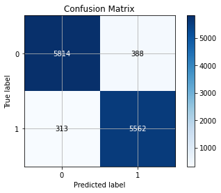

# CheckThis - Fake News Detector App

CheckThis is a Fake News Detection website developed by Jonathan Lee as part of the Final Year Project (FYP). The aim of this project is to create a simple web application to help ease the process of verifying the validity of a news article online

> Made with :heart: in Malaysia

Live Demo: [https://fakenewsdetectorapp.herokuapp.com/](https://fakenewsdetectorapp.herokuapp.com/)

## :bulb: Motivation
With the rapid growing rate of information over the internet, the topic of fake news detection on social media has recently attracted tremendous attention. The basic countermeasure of comparing websites against a list of labeled fake news sources is inflexible, and so a machine learning approach is desirable. This project aims to use Natural Language Processing (NLP) and Passive Aggressive Classifier to detect fake news directly, based on the text content of news articles.

## :pencil2: Objectives
1. To investigate and identify the key features of fake news
2. To design and develop a machine learning based fake news detection system
3. To validate the effectiveness of a machine learning based fake news detection system

## :speech_balloon: Dataset Overview

- scraped.csv: A full training dataset with the following attributes:
    - text: the text of the article
    - label: a label that marks the article as potentially unreliable
        - 1: Fake news/Unreliable news
        - 0: Real News/Reliable news

- Fake.csv: A fake testing training dataset with all the same attributes at scraped.csv 
- True.csv: A true testing training dataset with all the same attributes at scraped.csv 

Dataset Source: 
1. [scraped.csv](https://www.kaggle.com/shashankvikramsingh/fake-news-scraped)
2. [Fake.csv & True.csv](https://www.kaggle.com/clmentbisaillon/fake-and-real-news-dataset)

## :dart: Model Training
The Passive-Aggressive model is trained using `model.py` file and the model is stored in `ClassifierModel-new.sav` file. By using the dataset mentioned above, accuracy score is as below:

Accuracy: **94.33%** (Using `scraped.csv` as both training and testing dataset)

Confusion Matrix:

Further validation of model is done using `Fake.csv` & `True.csv`, which the final average accuracy score gotten is **70%**

## :computer: Technology Stack
1. Python
2. Scikit-learn
3. Flask Framework
4. HTML/CSS/JavaScript/Bootstrap

## :books: Third-Party Libraries

| Name                                                                              | Usage                                               |
| :-------------                                                                    | :----------:                                        |
|  [Newspaper3k](https://github.com/codelucas/newspaper)                            | To extract article text from URL                    |
|  [NewsAPI](https://newsapi.org/)                                                  | To get the latest news of the day                   |

## :octocat: Author
[Jonathan Lee](https://github.com/jonathanlee06)

## :bookmark_tabs: Licenses
This project is licensed under the MIT license. See the [LICENSE](https://github.com/jonathanlee06/FakeNewsDetectorApp/blob/master/LICENSE) file for more info.
